# Audapolis Architecture

Audapolis is a desktop application for spoken-word media editing with automatic transcription. This document provides a comprehensive overview of the system architecture, data flow, and key components.

## System Overview

Audapolis follows a **client-server architecture** where a React-based Electron frontend communicates with a Python backend server for transcription and audio processing capabilities.

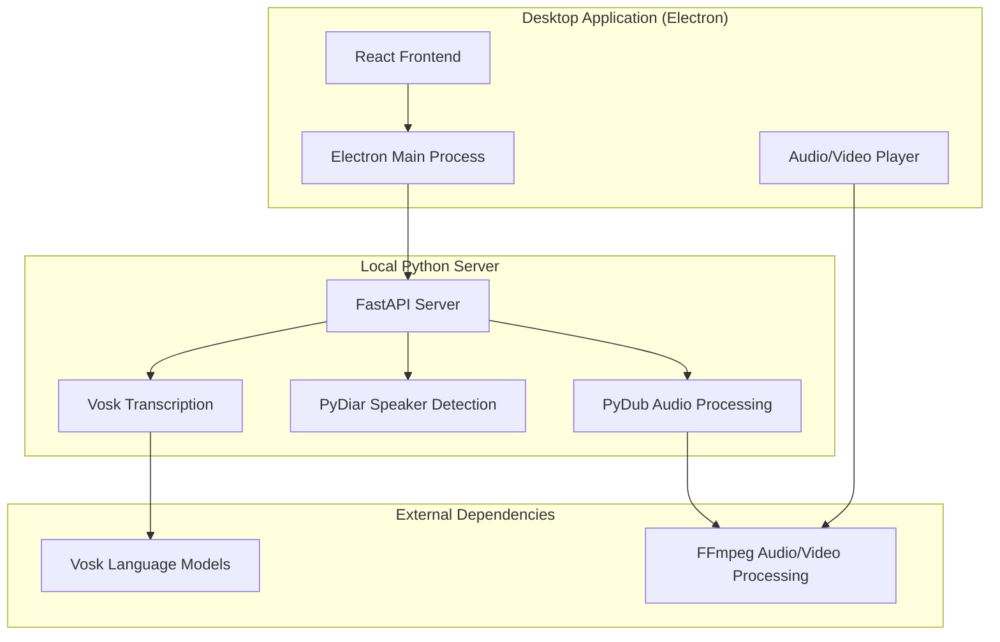

## Technology Stack

### Frontend (Electron App)

| Component | Technology | Purpose |
|-----------|------------|---------|
| **Framework** | Electron 32+ | Cross-platform desktop application |
| **UI Library** | React 17 + TypeScript | User interface and components |
| **Build Tool** | Vite 6 | Development server and bundling |
| **Styling** | Styled Components + Evergreen UI | Component styling and UI kit |
| **State Management** | Redux Toolkit + Redux Undo | Application state and undo/redo |
| **Audio/Video** | HTML5 Media APIs | Playback and synchronization |

### Backend (Python Server)

| Component | Technology | Purpose |
|-----------|------------|---------|
| **Framework** | FastAPI | HTTP API server |
| **Transcription** | Vosk | Speech recognition engine |
| **Speaker Diarization** | PyDiar | Speaker separation and identification |
| **Audio Processing** | PyDub | Audio manipulation and format conversion |
| **Timeline Export** | OpenTimelineIO | Professional video editing integration |

### External Tools

| Tool | Purpose | Integration |
|------|---------|-------------|
| **FFmpeg** | Audio/video conversion and processing | Via @tedconf/fessonia wrapper |
| **Language Models** | Speech recognition accuracy | Downloaded on-demand from Vosk |

## System Architecture Layers

### 1. Presentation Layer (React Components)

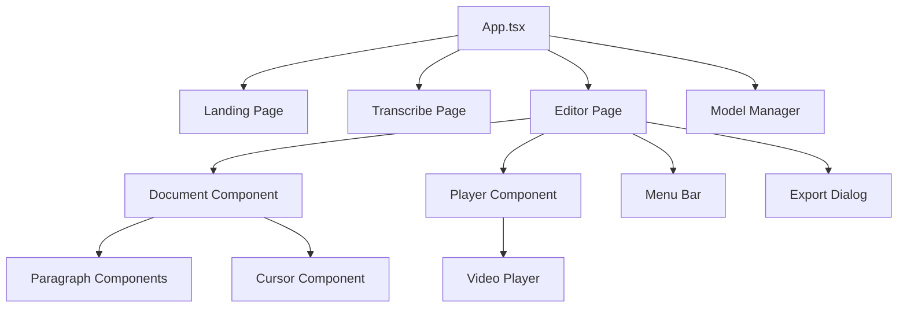

**Key Components:**
- **Landing Page**: File import and project management
- **Transcribe Page**: Transcription configuration and progress
- **Editor**: Main editing interface with document, player, and controls
- **Model Manager**: Language model download and management

### 2. State Management Layer (Redux)

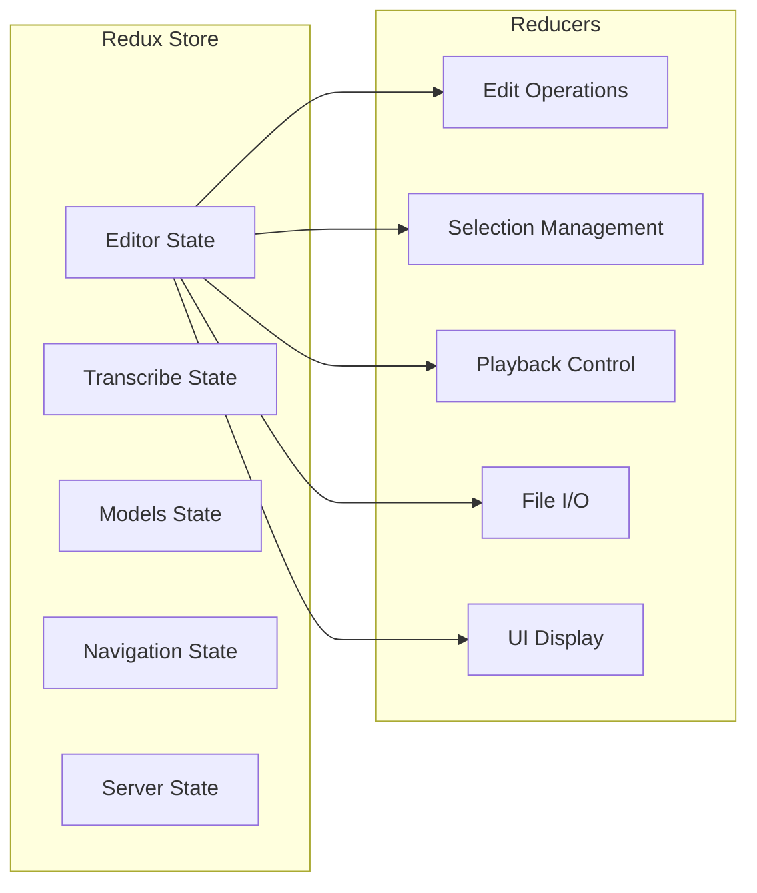

**State Structure:**
- **Document State**: Transcript content, timing, and metadata
- **Cursor State**: User and player cursor positions
- **Selection State**: Text selection and operations
- **Playback State**: Audio/video playback status
- **Export State**: Export progress and configuration

### 3. Business Logic Layer

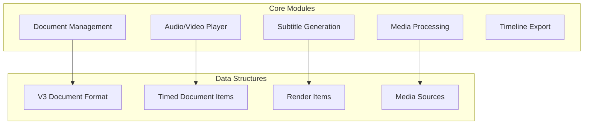

**Core Responsibilities:**
- **Document Management**: Loading, saving, and versioning `.audapolis` files
- **Player Core**: Audio/video synchronization and playback control
- **Media Processing**: Format conversion and export operations
- **Timeline Export**: Professional editing format generation

### 4. Data Access Layer

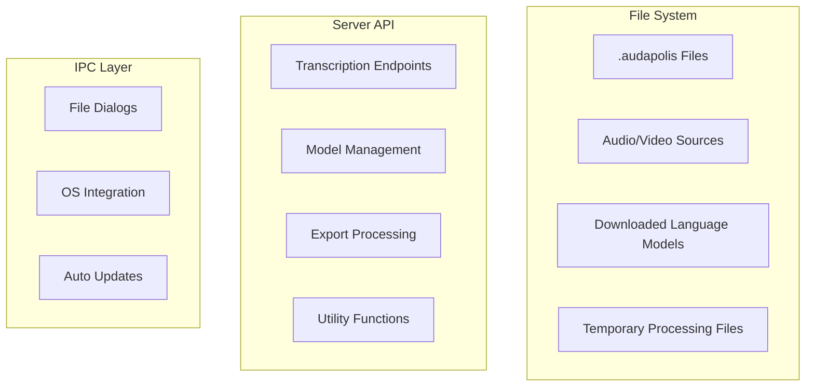

## Data Flow Architecture

### Transcription Workflow

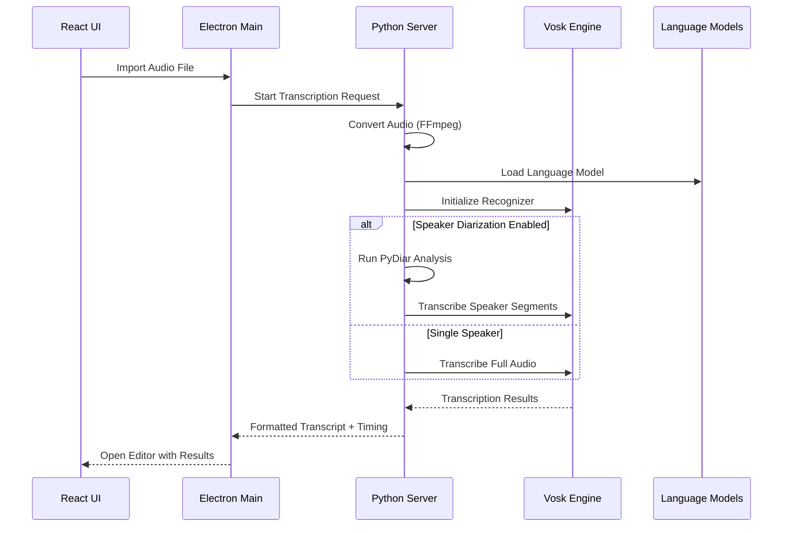

### Document Editing Workflow

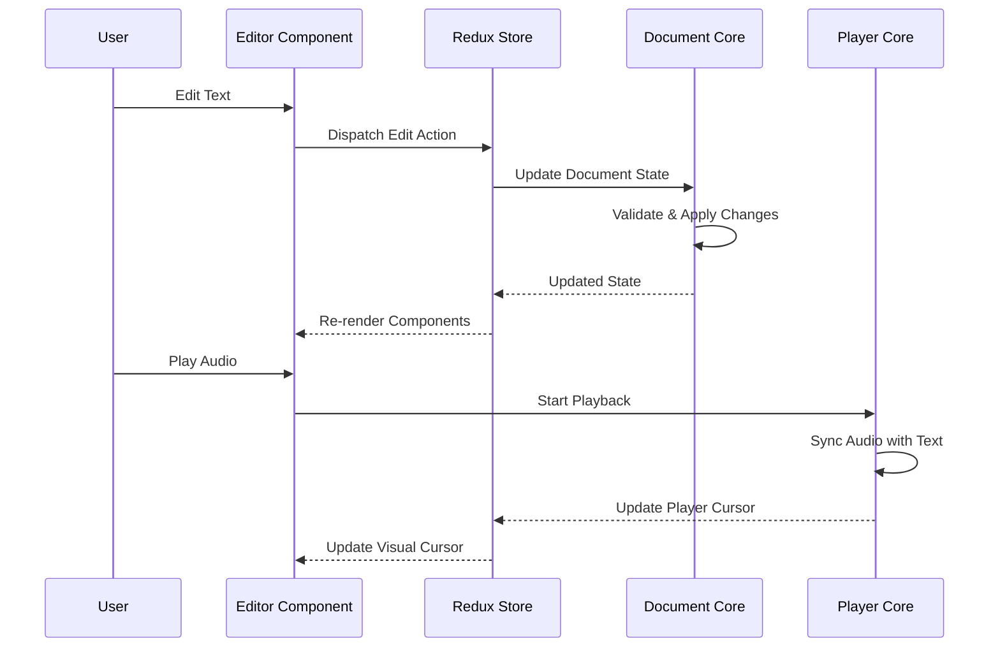

### Export Workflow

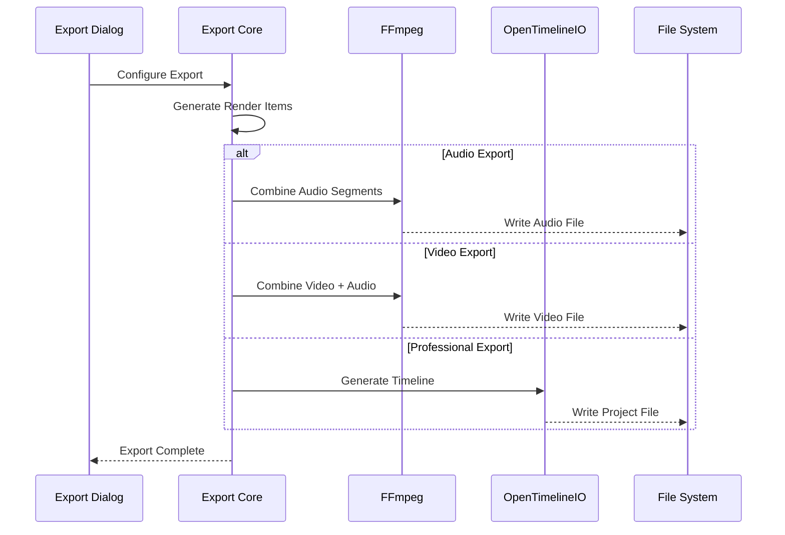

## File Format Architecture

### Project File Structure (.audapolis)

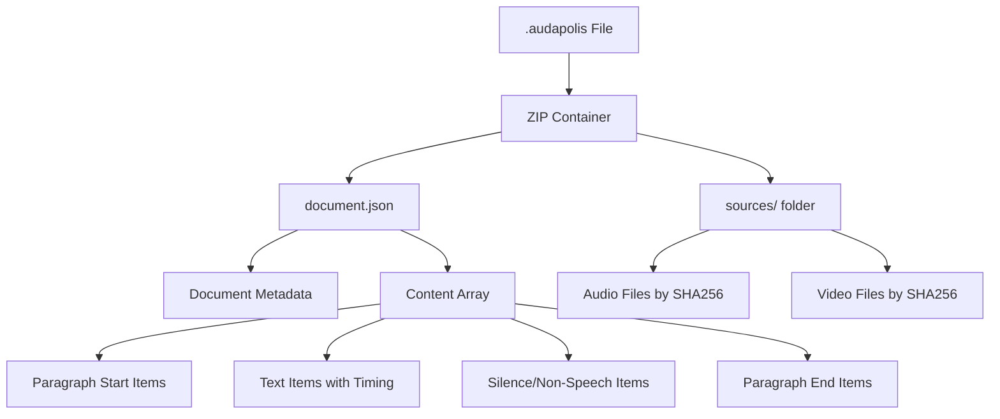

### Document Version Evolution

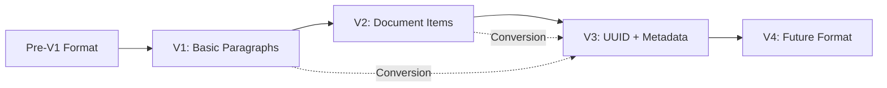

## Component Communication

### Inter-Process Communication (IPC)

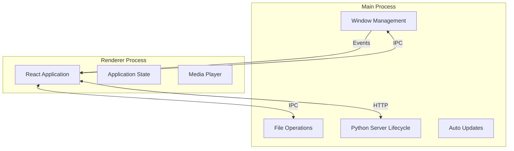

### Server Communication

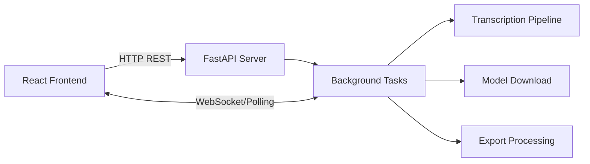

## Performance Architecture

### Memory Management

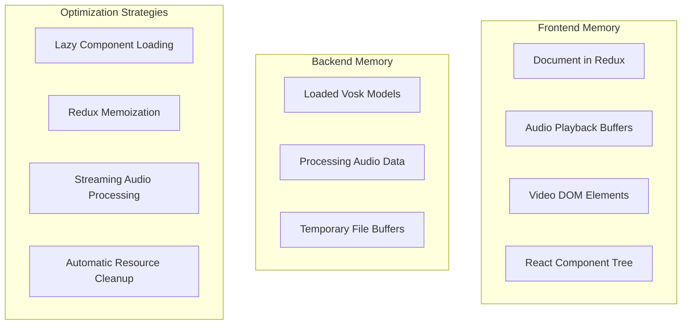

### Scalability Considerations

- **Large Files**: Progressive loading and streaming for multi-hour recordings
- **Multiple Projects**: Efficient memory cleanup when switching projects
- **Model Caching**: Smart loading/unloading of language models
- **Background Processing**: Non-blocking transcription and export operations

## Security Architecture

### Local Processing Model

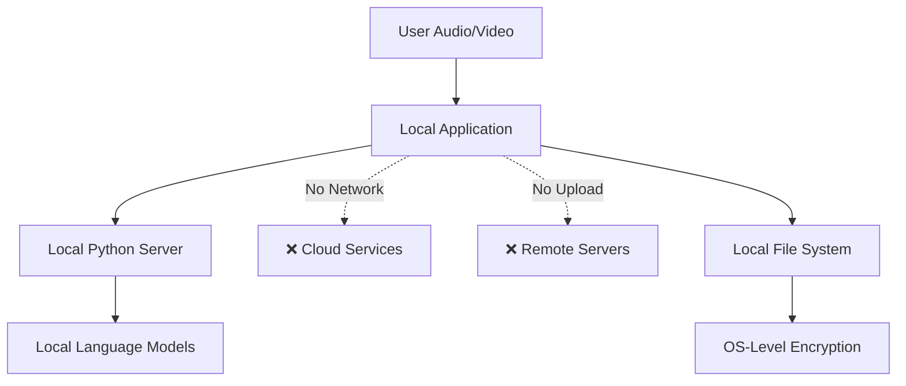

**Security Features:**
- **No Cloud Dependencies**: All processing happens locally
- **No Data Upload**: User content never leaves the device
- **Local Model Storage**: Language models cached locally
- **Standard File Permissions**: Uses OS-level file security

## Deployment Architecture

### Distribution Model

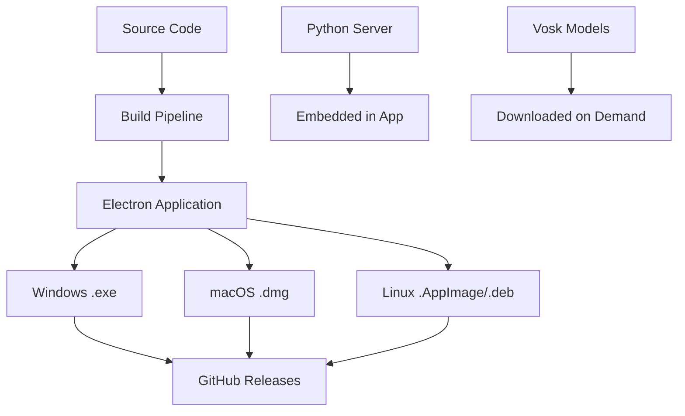

### Runtime Environment

- **Electron Process**: Manages application lifecycle and system integration
- **Python Server**: Auto-started subprocess for transcription services
- **Local Storage**: User documents and models stored in system directories
- **Auto-Updates**: Electron auto-updater for seamless updates

## Extension Points

### Future Architecture Considerations

1. **Plugin System**: Modular architecture supports future plugin development
2. **Cloud Integration**: Architecture can support optional cloud services
3. **Real-time Collaboration**: State management ready for multi-user features
4. **Advanced AI**: Transcription pipeline can integrate new AI models
5. **Mobile Support**: Core logic separable from Electron for mobile apps

---

This architecture provides a solid foundation for Audapolis's current capabilities while maintaining flexibility for future enhancements and scaling.
